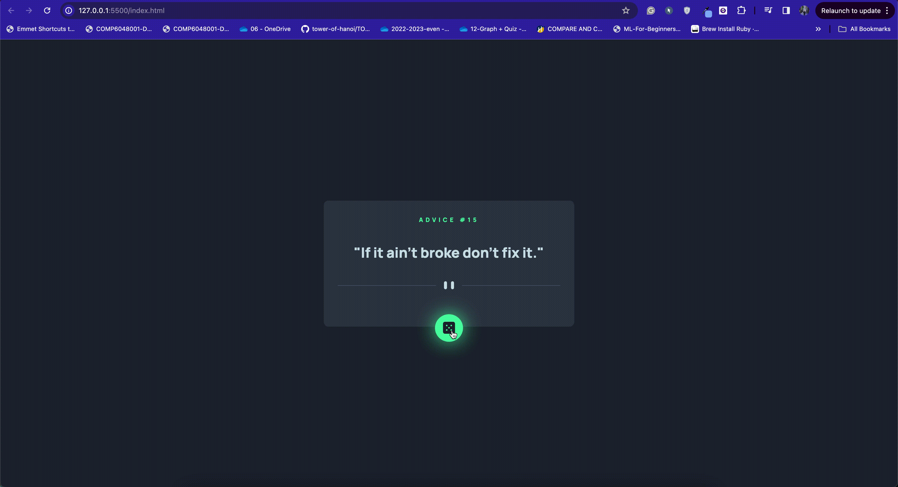

# Frontend Mentor - Advice generator app solution

This is a solution to the [Advice generator app challenge on Frontend Mentor](https://www.frontendmentor.io/challenges/advice-generator-app-QdUG-13db). Frontend Mentor challenges help you improve your coding skills by building realistic projects.

## Table of contents

- [Overview](#overview)
  - [The challenge](#the-challenge)
  - [Screenshot](#screenshot)
  - [Links](#links)
- [My process](#my-process)
  - [Built with](#built-with)
  - [What I learned](#what-i-learned)
  - [Continued development](#continued-development)
  - [Useful resources](#useful-resources)
- [Author](#author)
- [Acknowledgments](#acknowledgments)

## Overview

### The challenge

Users should be able to:

- View the optimal layout for the app depending on their device's screen size
- See hover states for all interactive elements on the page
- Generate a new piece of advice by clicking the dice icon

### Screenshot

### Links

- Solution URL: [https://www.frontendmentor.io/solutions/advice-generator-app-zIuIz5iF1D](https://www.frontendmentor.io/solutions/advice-generator-app-zIuIz5iF1D)
- Live Site URL: [https://jeffrey9427.github.io/advice_generator_app/](https://jeffrey9427.github.io/advice_generator_app/)

## My process

From the HTML file, I started to build the layout for my webpage based on the provided desktop design. Next, I worked on the CSS stylesheet to match the visualization outlined in the challenge. Lastly, I handled the random advice generation and button function with basic Javascript knowledge.

### Built with

- HTML
- CSS
- JavaScript

### What I learned

This challenge provided me an opportunity to recall the HTML, CSS, and JS concepts learned from HCI course in semester 1. Additionally, I learned how to fetch API data effectively in order to generate a random advice on my website.

### Continued development

I will use this simple project as an opportunity to continue learning and practicing web development skills, such as working with different devices sizes and functionalities or features.

### Useful resources

- [Youtube](https://www.youtube.com)
- [w3schools](https://www.w3schools.com/)

## Author

- Frontend Mentor - [@Jeffrey9427](https://www.frontendmentor.io/profile/Jeffrey9427)

## Acknowledgments

- There are a few youtube videos I followed throughout the process of making the website, such as [https://www.youtube.com/watch?v=KYOi96jzPSA](https://www.youtube.com/watch?v=KYOi96jzPSA) and [https://www.youtube.com/watch?v=pf6HX1CQ3Sc&t=347s](https://www.youtube.com/watch?v=pf6HX1CQ3Sc&t=347s)
